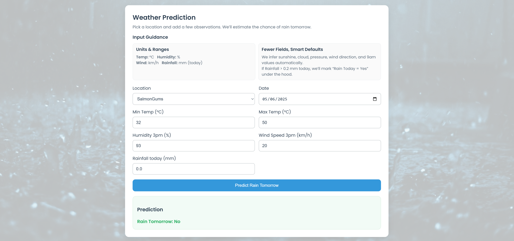
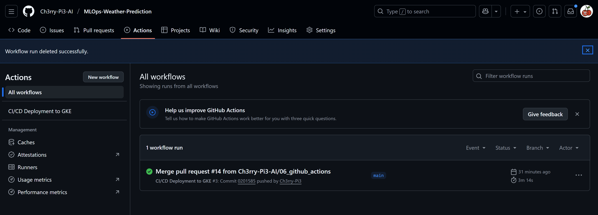

# 🌦️ **MLOps Weather Prediction — End-to-End CI/CD Deployment (GitHub Actions Edition)**

This repository demonstrates a **complete MLOps workflow** using a **weather dataset** to predict **“Will it rain tomorrow?”**, progressing from data preprocessing and model training to full web deployment through an automated **CI/CD (Continuous Integration and Continuous Deployment)** pipeline built with **GitHub Actions** and deployed to **Google Cloud Platform (GCP)**.

<p align="center">
  
</p>

While the prediction task — **rain-tomorrow classification** — is intentionally simple, the project’s core objective is to demonstrate a **production-grade MLOps pipeline** using **GitHub Actions** for automation, containerisation, and deployment through **Google Kubernetes Engine (GKE)**.

## 🧩 **Project Overview**

This project covers the **entire machine learning lifecycle** — from raw data ingestion to live cloud deployment — using a modular, reproducible, and scalable design. Each stage builds on the previous one to ensure seamless execution, traceability, and maintainability.

### 🌱 **Stage 00 — Project Setup**

A structured and maintainable repository was created with:

* Core directories: `src/`, `pipeline/`, `artifacts/`, and `img/`
* Dependency management via **`uv`** for environment reproducibility
* Editable package installation through `setup.py`
* Unified logging and exception-handling modules for transparency and debugging

This laid the groundwork for a robust, production-aligned MLOps pipeline.

### 🌦️ **Stage 01 — Data Processing**

The **`data_processing.py`** module handled the core preprocessing steps:

* Loading and cleaning the weather dataset
* Handling missing values and encoding categorical variables
* Splitting into training and test sets
* Persisting artefacts for reproducible experiments (`X_train.pkl`, `y_test.pkl`, etc.)

All transformations were logged to ensure reproducibility and transparency.

### 🧠 **Stage 02 — Model Training**

The **`model_training.py`** module trained an **XGBoost classifier** to predict **RainTomorrow**, and evaluated model performance using standard classification metrics:

* Accuracy, precision, recall, and F1-score
* Confusion matrix visualisation (`confusion_matrix.png`)
* Serialised model file (`model.pkl`)

All operations were wrapped in structured exception handling and logged for auditability.

### 🌈 **Stage 03 — Flask Application**

A **Flask web app** was developed to deploy the trained model through a minimal, user-friendly interface.

Users can input simple weather data (Location, Date, Min/Max Temp, Humidity3pm, WindSpeed3pm, optional Rainfall) while the app **infers all other features automatically** using season-aware rules before predicting rainfall likelihood.

Key components:

* Responsive UI (`templates/index.html`)
* Modern CSS design (`static/style.css`)
* Flask backend for live model inference (`app.py`)

<p align="center">
  
</p>

### ⚙️ **Stage 04 — Training Pipeline**

The **`pipeline/training_pipeline.py`** script combined **data preprocessing** and **model training** into a unified workflow that can be executed locally or via CI/CD.
This provided a **single orchestration layer** bridging local experimentation and automated cloud deployment.

### ☁️ **Stage 05 — Google Cloud Platform (GCP) Setup**

The cloud infrastructure was prepared in **Google Cloud Platform** to host containerised workloads and manage deployments via **GKE Autopilot**.

Setup steps included:

* Enabling essential APIs: **Kubernetes Engine**, **Artifact Registry**, and **Compute Engine**
* Creating an **Artifact Registry** (`mlops-weather-prediction`) in `us-central1`
* Setting up a **Service Account** with appropriate IAM roles
* Creating a **GKE Autopilot cluster** (`autopilot-cluster-1`) for deployment

This established a secure, scalable environment for CI/CD and MLOps operations.

### 🚀 **Stage 06 — CI/CD Deployment (GitHub Actions → GCP)**

The final stage introduced **GitHub Actions** to automate the build, test, and deploy cycle.
Each push to the `main` branch triggers a complete end-to-end pipeline defined in **`.github/workflows/deploy.yml`**.

The workflow performs:

1. **Build** — Construct a Docker image for the Flask app using the project’s `Dockerfile`
2. **Push** — Upload the image to **Google Artifact Registry**
3. **Deploy** — Apply `kubernetes-deployment.yaml` to **GKE**, updating the live service

Authentication, image management, and deployment are handled via official **`google-github-actions`** modules.

<p align="center">
  
</p>

Once the workflow completes successfully, the live application becomes accessible via the external **LoadBalancer endpoint** created by GKE.

## 💡 **Why GitHub Actions?**

GitHub Actions was selected for its **simplicity**, **integration**, and **seamless GCP compatibility** — ideal for reproducible MLOps pipelines.

### ✅ **Key Advantages**

* **Native GitHub integration** — triggers on push, pull request, or schedule
* **Lightweight YAML workflow definitions** under `.github/workflows/`
* **Secure secret management** via GitHub repository settings
* **First-class support** for GCP authentication and deployment
* **Zero infrastructure management** with hosted runners
* **Fast execution and rich logs** for debugging and monitoring

GitHub Actions offers a clean, unified experience for building, testing, and deploying MLOps workloads without maintaining additional CI servers.

## 🗂️ **Final Project Structure**

```text
mlops_weather_prediction/
├── .venv/                          # 🧩 Local virtual environment (created by uv)
├── artifacts/                      # 💾 Data, processed artefacts, and model outputs
│   ├── raw/
│   ├── processed/
│   └── models/
├── pipeline/
│   └── training_pipeline.py         # Unified data preprocessing + model training
├── src/
│   ├── data_processing.py
│   ├── model_training.py
│   ├── logger.py
│   └── custom_exception.py
├── templates/
│   └── index.html                   # Flask front-end UI
├── static/
│   ├── style.css
│   └── img/app_background.jpg
├── img/
│   ├── flask/flask_app.gif          # Animated UI demo
│   ├── github_actions/              # GitHub Actions + GCP screenshots
│   └── gcp/
├── Dockerfile                       # 🐳 Container image definition for Flask app
├── kubernetes-deployment.yaml       # ☸️ Kubernetes Deployment + Service config
├── .github/
│   └── workflows/
│       └── deploy.yml               # ⚙️ GitHub Actions workflow definition
├── app.py                           # Flask application entry point
├── pyproject.toml                   # Project metadata
├── setup.py                         # Editable installation
└── requirements.txt                 # Dependencies
```

## 🌐 **End-to-End Workflow Summary**

1. **Data Processing** → Clean, encode, and save processed data
2. **Model Training** → Train, evaluate, and export the XGBoost model
3. **Flask Application** → Serve predictions interactively
4. **Pipeline Orchestration** → Combine preprocessing + training
5. **GCP Setup** → Configure registry, service account, and cluster
6. **CI/CD Deployment** → Automate build → push → deploy via GitHub Actions

## ✅ **In Summary**

This project turns a straightforward **weather classification problem** into a **fully automated MLOps system**.
It showcases how to **operationalise machine learning pipelines** using **GitHub Actions** and **Google Cloud Platform**, covering every phase — from data ingestion to scalable cloud deployment — in a **reproducible, production-ready** workflow.
