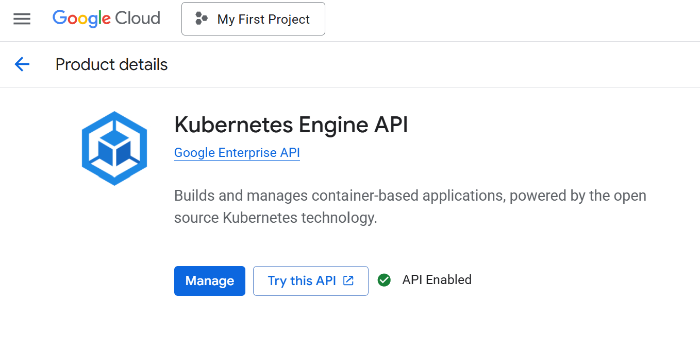
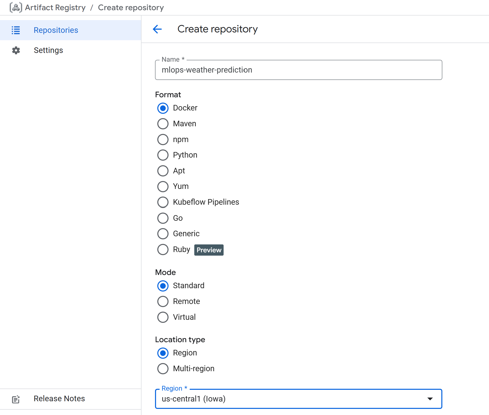
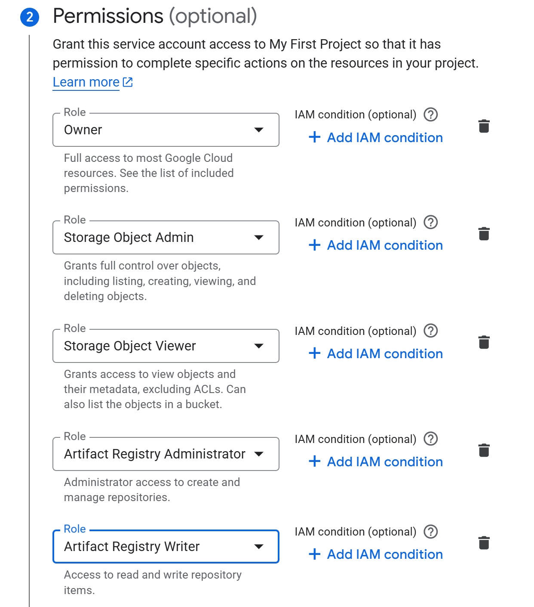
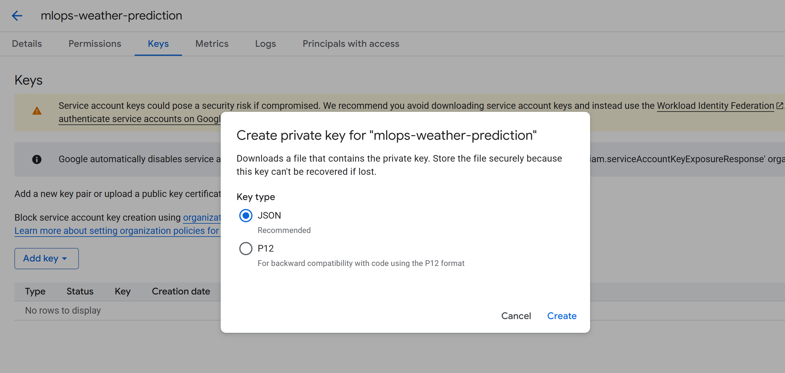
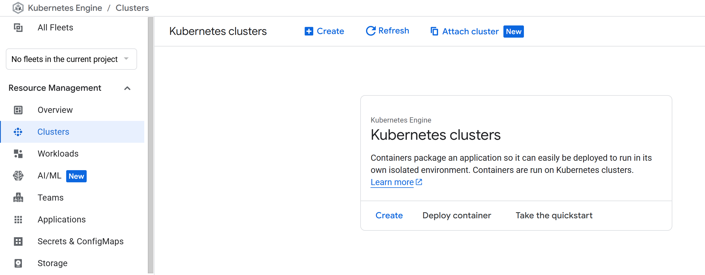
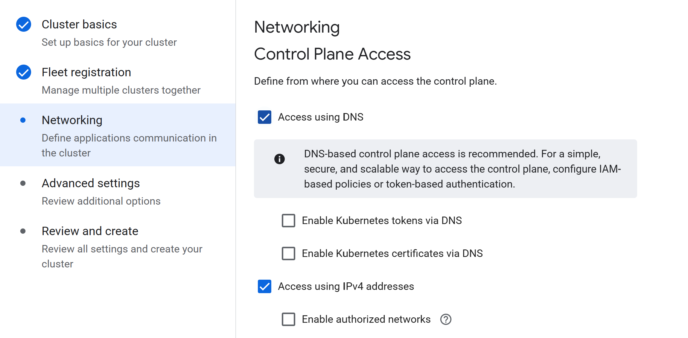

# ☁️ **Google Cloud Platform (GCP) Setup — MLOps Weather Prediction**

This stage introduces **Google Cloud Platform (GCP)** configuration for the **MLOps Weather Prediction** project.
The setup prepares the cloud infrastructure necessary for deploying containerised machine learning workflows and the **Flask weather prediction app** using **Kubernetes (GKE)**, **Artifact Registry**, and **Service Accounts** with secure IAM permissions.

By completing this stage, your environment will be fully configured to build, store, and deploy Docker containers directly from your **GitLab CI/CD pipelines** into a **GKE Autopilot** cluster within the **us-central1 (Iowa)** region.

## 🌐 Overview

This GCP configuration involves five essential steps:

1. Enabling required APIs
2. Creating an Artifact Registry repository
3. Setting up a Service Account and generating a JSON key
4. Creating a Kubernetes Autopilot cluster
5. Ensuring regional consistency and secure network access

Each step ensures the environment is cloud-ready, secure, and aligned for **MLOps deployment**.

## 1️⃣ Enable Required APIs

Visit your [Google Cloud Console](https://console.cloud.google.com) and open:
**Navigation Menu → APIs & Services → Library**

Enable the following APIs:

* **Kubernetes Engine API**
* **Google Container Registry API**
* **Compute Engine API**
* **Identity and Access Management (IAM) API**
* **Cloud Build API**
* **Cloud Storage API**

Once enabled, you’ll see a confirmation screen like this:

<p align="center">
  
</p>

These APIs provide the core functionality required for building, storing, and deploying your application within GCP.

## 2️⃣ Create an Artifact Registry Repository

From the main GCP console, search for **“Artifact Registry”**.
Click **+ Create Repository** and fill in the following details:

* **Repository name:** `mlops-weather-prediction`
* **Region:** `us-central1 (Iowa)`
* **Format:** Docker
* Leave other options as default.
* Scroll to the bottom and click **Create**.

<p align="center">
  
</p>

This repository securely stores the Docker images for your Flask app and other pipeline artefacts that will later be deployed via GitLab CI/CD.

## 3️⃣ Create a Service Account

Go to **Navigation Menu → IAM & Admin → Service Accounts** and click **+ Create Service Account**.

1. **Name:** `mlops-weather-prediction`
2. Assign the following permissions under **Roles**:

   * Artifact Registry Administrator
   * Kubernetes Engine Developer
   * Service Account User
   * Storage Admin
   * Compute Viewer

<p align="center">
  
</p>

Click **Create**. Once done, locate your new service account, click **Actions → Manage Keys → Add Key → Create new key**, and choose **JSON** as the key type.

<p align="center">
  
</p>

Click **Create** to download your JSON key file.
Keep this file safe — it will later be used in your GitLab CI/CD environment to authenticate the pipeline with GCP services.

## 4️⃣ Create a Kubernetes Autopilot Cluster

Search for **“Kubernetes Engine”** in the GCP Console, then go to **Clusters** from the left sidebar.

<p align="center">
  
</p>

Click **Create Cluster** and select **Autopilot** mode (recommended for managed workloads).

<p align="center">
  
</p>

In the **Cluster Basics** section:

* **Cluster name:** `autopilot-cluster-1`
* **Region:** `us-central1` (must match your Artifact Registry region)

Under **Networking**, make sure both options are checked:

* ✅ **Access using DNS**
* ✅ **Access using IPv4 addresses**

<p align="center">
  
</p>

Keep advanced options as defaults and click **Create**.
Cluster provisioning may take a few minutes. Wait until it reaches a **Running** state before continuing.

## 5️⃣ Verify and Align Regions

After your cluster and repository are created, verify that both share the **same region** (`us-central1`).
This consistency ensures low latency and avoids cross-region deployment errors during CI/CD builds.

You can confirm this by checking:

```bash
gcloud artifacts repositories list
gcloud container clusters list
```

## ✅ In Summary

By the end of this stage:

* All critical **GCP APIs** are active.
* A secure **Artifact Registry** (`mlops-weather-prediction`) is ready to store Docker images.
* A **Service Account** and JSON key are created for CI/CD authentication.
* A **GKE Autopilot cluster** (`autopilot-cluster-1`) has been provisioned in `us-central1`.
* Regional and network configurations are aligned for deployment.

Your GCP environment is now ready for:

* 🔁 Automated builds via **GitLab CI/CD**
* 🐳 Containerised **Flask app deployments**
* ☁️ Scalable MLOps infrastructure for retraining and continuous delivery

This setup completes the **cloud infrastructure foundation** for the **MLOps Weather Prediction** project — enabling seamless, secure, and reproducible deployments to Google Cloud.
